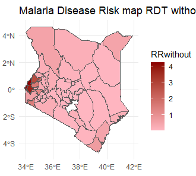

# Malaria-Risk-Modelling

## Project Overview
This project uses spatial modeling techniques to assess malaria risk among children under five in Kenya. The analysis is based on health data from the Kenya Demographic and Health Survey (KDHS) and incorporates geographic data for spatial analysis. The goal is to identify areas with high malaria risk and provide insights that could inform targeted malaria interventions.

## Objectives

### Main Objective
To model malaria risk among children under five in Kenya.

### Specific Objectives
1. To develop a spatial model to assess the distribution of malaria risk among children under five in Kenya using both rapid diagnostic tests (RDT) and microscopy test results.
2. To compare spatial patterns of malaria risk based on RDT versus microscopy diagnostic methods.

## Data

### 1. Health Data
The primary dataset is sourced from the **Kenya Demographic and Health Survey (KDHS) 2020**, which includes information on health indicators, demographic data, and other factors relevant to malaria risk among children under five. Due to the sensitive nature of this dataset, it is not shared publicly in this repository. However, users can request access to the KDHS data from the [DHS Program website](https://dhsprogram.com).

### 2. Geographic Shapefiles
Geographic shapefiles containing the administrative boundaries of Kenya are used to map and analyze the spatial distribution of malaria risk. These shapefiles allow for the visualization of malaria prevalence across different regions.

## Methodology

The spatial modeling approach in this project is inspired by Paula Moraga's work on disease mapping and spatial epidemiology. The **BYM model** (Besag-York-Mollié) is adapted here to model spatial risk. The R code uses packages such as `INLA` for Bayesian inference, `sp` for spatial data handling, and `ggplot2` for visualization. Specific steps include:

1. **Data Preprocessing**: Cleaning and structuring KDHS and shapefile data.
2. **Spatial Modeling**: Using Bayesian spatial models to estimate malaria risk across regions.
3. **Visualization**: Creating maps to illustrate areas of high and low malaria risk, facilitating insights for public health interventions.

## Results

### Malaria Risk Maps
This analysis includes spatial visualizations of malaria risk across different regions. These maps reveal areas with high malaria risk, which can help guide malaria control efforts.

## Acknowledgments
This project is inspired by and adapted from the work of Paula Moraga, whose methodologies for disease mapping and spatial epidemiology served as a reference. Special thanks to the DHS Program for providing access to health data that made this analysis possible.
